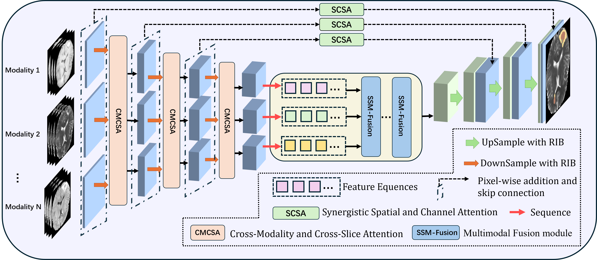
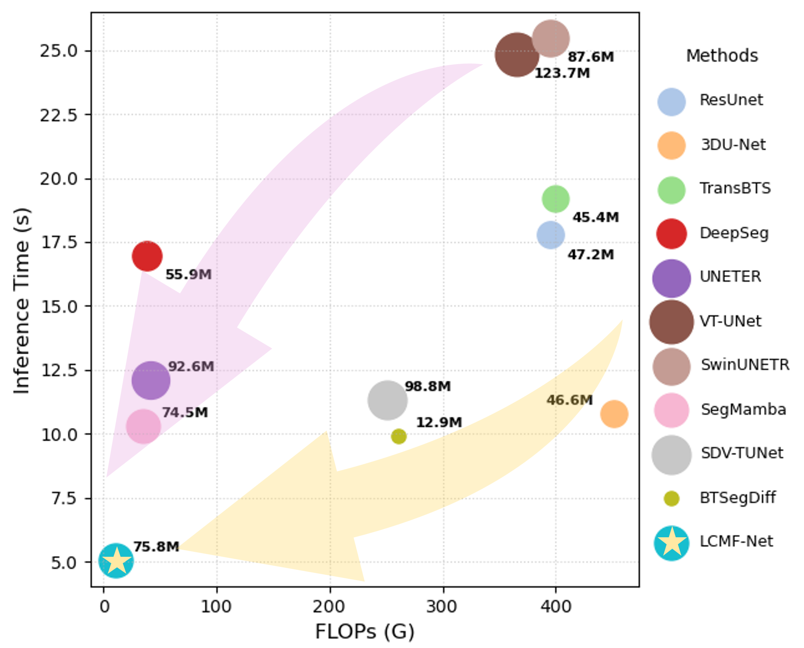
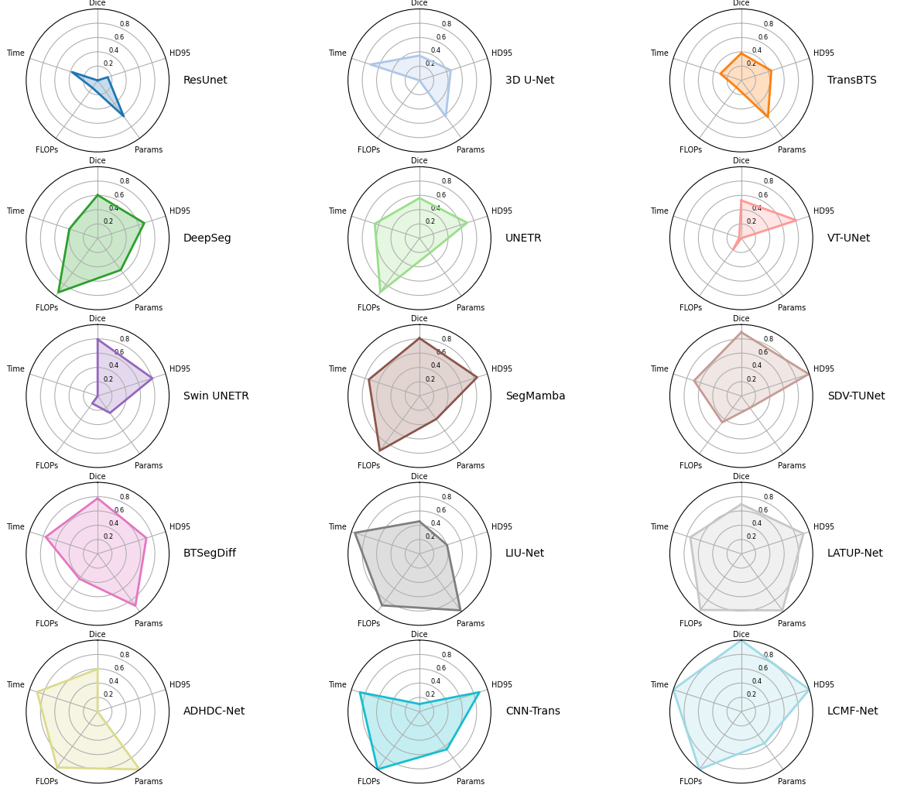

# LCMF-Net

**Now we have open-sourced the pre-processing, training, inference, and metrics computation codes.**

Cao, G., Yang, Z., Liang, W., Zhang, S., Zhong, T., Mao, H., Wang, D., Zong, M. LCMF-Net: A Lightweight Collaborative Multimodal Fusion Network for Brain Tumor Segmentation. Neural Networks, 2026(195): 108257. https://doi.org/10.1016/j.neunet.2025.108257. (IF 6.3)




## Contact 
If you have any questions about our project, please feel free to contact us by email at zJuny_e@163.com or via WeChat at 19121670239.

## Environment install
Clone this repository and navigate to the root directory of the project.

```bash
git clone https://github.com/IAAI-SIT/LCMF-Net.git

cd LCMF-Net
```
### Install causal-conv1d

```bash
cd causal-conv1d

python setup.py install
```

### Install VSSM

```bash
cd mamba

python setup.py install
```


## Preprocessing, training, testing, inference, and metrics computation

### Data downloading 

Data is from [https://www.med.upenn.edu/cbica/brats/]


### Preprocessing
First, we need to perform preprocessing on the raw data, such as slicing and alignment..

```bash 
cd DataProcess
python singleModel.py
```

After pre-processing, the data structure will be in this format:

### Training 

When the pre-processing process is done, we can train our model.

Please replace the relevant path parameters in the code with your dataset path before training.


```bash 
python train.py
```

The training logs and checkpoints are saved in:
**logdir = f"./runs/models"**


### Inference 

When we have trained our models, we can inference all the data in testing set.

```bash 
python test.py
```

When this process is done, the prediction cases will be put in this path:
**save_path = "./runs/output"**

### Metrics computation
We can obtain the Dice score and HD95 on each segmentation target (WT, TC, ET) using this code:

```bash
python parameter.py
```

In this project, we also provide pre-trained model weights and log files under the models directory. Additionally, the images directory contains comparison images and visualizations of the corresponding results.

## Acknowledgement
Many thanks for these repos for their great contribution!

[https://github.com/ge-xing/SegMamba)

[https://github.com/state-spaces/mamba)

[https://github.com/hustvl/Vim](https://github.com/hustvl/Vim)

[https://github.com/bowang-lab/U-Mamba](https://github.com/bowang-lab/U-Mamba)

